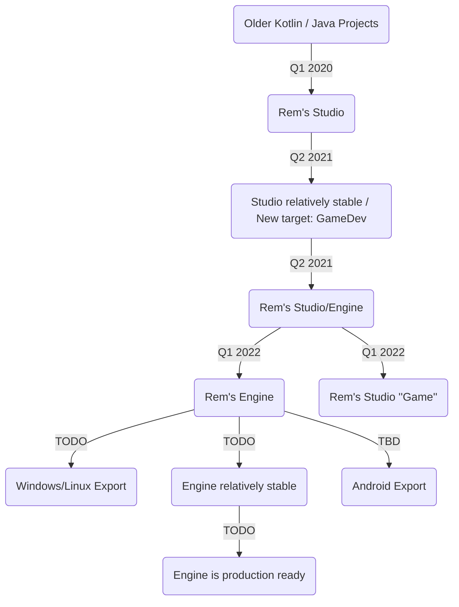

# Game Engine: Rem's Engine

Parallel to this video editor, I am developing my own game engine. I have often written the beginnings of small games,
but they always had much in common, so I decided to write my own engine.

- direct Java/Kotlin support
- usable in my favourite IDE: Intellij Idea
- completely Open Source
- no fees
- hopefully in the future fewer annoyances with skeletons than Unreal Engine
- support for all kinds of formats
- working/loading from inside compressed folders
- hopefully fewer files than Unity, with their one-meta-for-every-file-strategy
- I get to learn even more about game engines <3

This engine does not have the target to offer the best graphics, or be the best performant. Its goal is to be nice and
quick to develop in, like a tool box.

## Project Plan

I was writing the game engine in this same repository as [Rem's Studio](https://github.com/AntonioNoack/RemsStudio), because

- they share a lot of code,
- I want to base the video studio on the engine in the future
- currently, the engine needs to be based on the video editor
- when I started the engine, the video studio already was a huge project

To develop them properly, I ofc had to split them. I finished the split in Q1 2022.

<!-- the following graph should work starting Jan-Mar 2022 -->
<!-- TB = top-bottom, LR = left-right -->

## Features

- entity - component based system
    - because I like the system from Unity more than that of Godot (still imperfect)
- 64 bit fp transformations for universe simulations
- supports loading all kinds of formats
- can load files from compressed folders
- pbr workflow
- Bullet as physics engine
    - running on a separate thread for uninterrupted graphics
    - running with 64 bit floating precision for accuracy / universe simulations
- mods / plugins from the start: your game is a mod for the engine
- event based
- auto switch between forward- and deferred rendering
    - for beautiful MSAA with a few lights,
    - or thousands of lights without performance hit
    - forward rendering does not support ss reflections and ssao
- depth-edge-detection based anti-aliasing (like FXAA)
- shadows with cascades (directional, spot, point)
- planar reflections
- screen space reflections
- screen space ambient occlusion
- static meshes
- animated meshes
- aabb optimized scene hierarchy
- bloom to convey brightness
- AMD FSR: dynamic upscaling and sharpening
    - is used to upscale images in the file explorer as well
- controller support
    - works for UI automatically
    - you can even use your controller in other programs as a mouse, while Rem's Engine/Studio is running :3
- bare-bones support for .blend files from Blender, so you don't have to export manually
- automatic file reload, on file change

## Planned Features
- nice UI system
- easy local multiplayer
- environment maps as lights
- compute environment maps from the scene for reflections
- animation trees
- shader graphs
- transparent meshes
- export to Windows/Linux

## Maybe Later Features
- export to Web
- export to Android <!--
videos on Android using https://stackoverflow.com/questions/9375598/android-how-play-video-on-surfaceopengl?
-->
- light baking for realistic graphics
- trees for much stuff: animations, shaders
- visual coding?
- path finding algorithms
- block based library?
- save files
- multiplayer system?
- support separate mice / keyboards for local multiplayer?
- support controller + mouse/keyboard for one more local player
- when we have no videos, we could ship without ffmpeg
- additional 2d physics engine

## Used libraries

* [LWJGL](https://www.lwjgl.org/) (Graphics and Audio; OpenGL + GLFW + OpenAL + stb + jemalloc)
* [Assimp](https://github.com/assimp/assimp) (loading 3d meshes, from LWJGL)
* [JOML](https://github.com/JOML-CI/JOML) (Matrix calculations and transforms for rendering)
* [FFMpeg](https://ffmpeg.org/) (Video/Image/Audio Import & Export)
* [HSLuv](https://github.com/hsluv/hsluv-java) (HSL alternative with constant brightness)
* [LanguageTool](https://languagetool.org/) (Spellchecking)
* [JTransforms](https://sites.google.com/site/piotrwendykier/software/jtransforms) (Fast Fourier Transform)
* [Apache Imaging](https://commons.apache.org/proper/commons-imaging/) (More supported image formats, like .ico)
* [Apache CLI](https://commons.apache.org/proper/commons-cli/) (Basics of Command Line Interface)
* [Metadata Extractor](https://github.com/drewnoakes/metadata-extractor) (Detecting rotated JPEG files)
* [JNA Platform](https://github.com/java-native-access/jna) (Moving files to trash)
* [Apache PDFBox](https://pdfbox.apache.org/) (Rendering PDFs)
* [JAI ImageIO Core](https://github.com/jai-imageio/jai-imageio-core) (More image formats for PDFs)
* [JAI ImageIO JPEG2000](https://github.com/jai-imageio/jai-imageio-jpeg2000) (JPEG 2000 support for PDFs)
* [jUnRAR](https://github.com/edmund-wagner/junrar)
  , [Apache VFS](https://search.maven.org/artifact/org.apache.commons/commons-vfs2/2.8.0/jar) (Reading RAR files)
* [Image4j](https://github.com/imcdonagh/image4j) (Reading ICO images)
* [Bullet](http://jbullet.advel.cz/) (3d Physics, adjusted to be FP64 instead of FP32)
* [Box2d](https://github.com/jbox2d/jbox2d) (2d Physics, still FP32)
<!-- removed because it is slow, because of too many branches 
* [OpenSimplexNoise](https://gist.github.com/KdotJPG/b1270127455a94ac5d19) (Noise Generator) -->

## Build

The project can be built similar to [Rem's Studio](https://github.com/AntonioNoack/RemsStudio), just the main class now is me.anno.engine.RemsEngine.
All listed libraries need to be added to the project in some way.

## Wiki

Since both projects originate from the same base, the Wiki currently is located at Rem's Studio's repository.