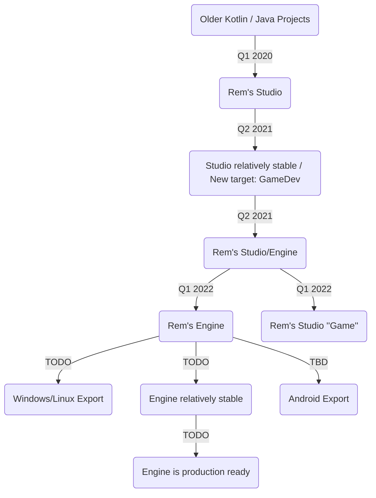

# Game Engine: Rem's Engine

Parallel to my video editor "Rem's Engine", I am developing my own game engine. I have often written the beginnings of small games,
but they always had much in common, so I decided to write my own engine.

- direct Java/Kotlin support
- usable in my favourite IDE: Intellij Idea
- completely Open Source
- no fees
- hopefully in the future fewer annoyances with skeletons than Unreal Engine
- support for all kinds of formats
- working/loading from inside compressed folders
- I get to learn even more about game engines <3

This engine does not have the target to offer the best graphics, or be the best performant. Its goal is to be nice and
quick to develop in, like a tool box.

## Project Plan

I was writing the game engine in this same repository as [Rem's Studio](https://github.com/AntonioNoack/RemsStudio), because

- they share a lot of code,
- I wanted to base the video studio on the engine in the future
- the engine needed to be based on the video editor
- when I started the engine, the video studio already was a huge project

To develop them properly, I ofc had to split them. I finished the split in Q1 2022.

<!-- the following graph should work starting Jan-Mar 2022 -->
<!-- TB = top-bottom, LR = left-right -->

## Features

- entity - component based system
  - because I like the system from Unity more than that of Godot (still imperfect)
- 64 bit fp transformations for universe simulations
- supports loading all kinds of formats
  - Image formats (ffmpeg, ImageIO, Image4j, custom): png, jpg, tga, ico, dds, exr, hdr, svg, pcx, xcf (Gimp)
  - Video formats (ffmpeg): wav, mp3, mp4, avi, flv, gif
  - Mesh formats (Assimp, custom) obj, fbx, gltf, dae, blend, vox, md2, md5mesh
  - Package formats (Apache Compress, JUnRar): zip, tar, tar.gz, rar, 7z, bz2, lz4, xar, oar
  - Metadata formats (custom): json, csv, yaml
  - Others (Apache PDFBox, custom): pdf, tar/text-based Unity-packages
  - Note: not all are fully supported
- can load files from compressed folders
- pbr workflow
- Bullet as 3d physics engine
    - running on a separate thread for uninterrupted graphics (optional)
    - running with 64 bit floating precision for accuracy / universe simulations
- Box2d as 2d physics engine
    - currently a prototype
- mods / plugins from the start: your game is a mod for the engine
- event based
- simple switch between forward- and deferred rendering
    - for beautiful MSAA with a few lights,
    - or thousands of lights without performance hit
    - forward rendering does not support SSR nor SSAO
- depth-edge-detection based anti-aliasing (like FXAA)
- different light types, with shadow support: directional, spot, point
- shadows with cascades (directional)
- planar reflections
- screen space reflections (SSR)
- screen space ambient occlusion (SSAO)
- static, animated and procedural meshes
- static and animated meshes can be instanced
- signed distance functions as mesh replacement
- aabb optimized scene hierarchy
- bloom to convey brightness
- AMD FSR: dynamic upscaling and sharpening
    - is used to upscale images in the file explorer as well
- controller support
    - works for UI automatically
    - you can even use your controller in other programs as a mouse, while Rem's Engine/Studio is running :3
- automatic file reload, on file change
- Android-inspired UI with integrated spellchecking
- very basic Lua scripting
- utilities like path-finding
- spellchecking in most input fields

## Planned Features
- easy local multiplayer
- usable Multiplayer, local and tcp/udp
- environment maps as lights
- compute environment maps from the scene for reflections
- animation trees
- shader graphs
- transparent meshes
- export to Windows/Linux
- usable Gizmos 🙈
- fully supported Lua scripting
- surfel based global illumination

## Maybe Later Features
- export to Web
- export to Android <!--
videos on Android using https://stackoverflow.com/questions/9375598/android-how-play-video-on-surfaceopengl?
-->
- light baking for realistic graphics
- trees for much stuff: animations, shaders
- visual coding?
- support separate mice / keyboards for local multiplayer?
- when we have no videos, we could ship without ffmpeg

## Projects using Rem's Engine
- [Rem's Studio](https://github.com/AntonioNoack/RemsStudio)
- [Cellular Automata](https://github.com/AntonioNoack/CellularAutomata)
- [Tsunami Simulation](https://github.com/AntonioNoack/RemsTsunamis)
- [Voxel World](https://github.com/AntonioNoack/RemsEngine-VoxelWorld)
- a few more, non-published (yet?)

## Getting Started
- Download an IDE of your choice. I prefer Intellij Idea, but have worked with Eclipse in the past.
- Download either the engine source code, and compile it yourself, or download a pre-compiled jar.
  - If there is no release available yet, just ask for a build, and I'll create one :)
- Add the engine jar as a dependency to your project.
- Either create an extension (mod), or work directly with the engine.

## Samples
Besides my personal projects that use Rem's Engine, there is also quite a few samples within the engine source code.

Some tests, starting the whole engine, like a small game:
- [GFX: MarchingCubes.kt](src/me/anno/maths/geometry/MarchingCubes.kt)
- [Math: PathfindingAccTest.kt](src/me/anno/maths/paths/PathFindingAccTest.kt)

Some feature tests:
- [Math: SDFTest.kt](src/me/anno/ecs/components/collider/SDFTest.kt)
- [Internal: Hierarchy.kt](src/me/anno/ecs/prefab/Hierarchy.kt)
- [GFX: MarchingSquares.kt](src/me/anno/maths/geometry/MarchingSquares.kt)
- [GFX: Reduction.kt](src/me/anno/gpu/shader/Reduction.kt)
- [GFX: FSR.kt](src/me/anno/ecs/components/shaders/effects/FSR.kt)
- [Debug: JsonFormatter.kt](src/me/anno/io/json/JsonFormatter.kt)
- [UI: DrawCurves.kt](src/me/anno/gpu/drawing/DrawCurves.kt)
- [UI: AnimTest.kt](src/me/anno/ui/anim/AnimTest.kt)

To find more examples, search for "fun main(args: Array<String>)" in the source code.

## Ports
- [Android](https://github.com/AntonioNoack/RemsEngine-Android)

## Used libraries

* [LWJGL](https://www.lwjgl.org/) (Graphics and Audio; OpenGL + GLFW + OpenAL + stb (audio))
* [Assimp](https://github.com/assimp/assimp) (loading 3d meshes; from LWJGL)
* [JOML](https://github.com/JOML-CI/JOML) (Matrix calculations and transforms for rendering)
* [FFMpeg](https://ffmpeg.org/) (Video/Image/Audio Import & Export)
* [HSLuv](https://github.com/hsluv/hsluv-java) (HSL alternative with constant brightness)
* [LanguageTool](https://languagetool.org/) (Spellchecking)
* [JTransforms](https://sites.google.com/site/piotrwendykier/software/jtransforms) (Fast Fourier Transform)
* [Apache Imaging](https://commons.apache.org/proper/commons-imaging/) (More supported image formats, like .ico)
* [Apache CLI](https://commons.apache.org/proper/commons-cli/) (Basics of Command Line Interface)
* [Metadata Extractor](https://github.com/drewnoakes/metadata-extractor) (Detecting rotated JPEG files)
* [JNA Platform](https://github.com/java-native-access/jna) (Moving files to trash)
* [Apache PDFBox](https://pdfbox.apache.org/) (Rendering PDFs)
* [JAI ImageIO Core](https://github.com/jai-imageio/jai-imageio-core) (More image formats for PDFs)
* [JAI ImageIO JPEG2000](https://github.com/jai-imageio/jai-imageio-jpeg2000) (JPEG 2000 support for PDFs)
* [jUnRAR](https://github.com/edmund-wagner/junrar), [Apache VFS](https://search.maven.org/artifact/org.apache.commons/commons-vfs2/2.8.0/jar) (Reading RAR files)
* [Image4j](https://github.com/imcdonagh/image4j) (Reading ICO images)
* [Bullet](http://jbullet.advel.cz/) (3d Physics, adjusted to be FP64 instead of FP32)
* [Box2d](https://github.com/jbox2d/jbox2d) (2d Physics, still FP32)
* [LuaJ](https://github.com/luaj/luaj) (Lua scripting)
* [QOI-Java](https://github.com/saharNooby/qoi-java) (QOI image format)

## Build It

The project can be built like [Rem's Studio](https://github.com/AntonioNoack/RemsStudio), just the main class now is [me.anno.engine.RemsEngine](src/me/anno/engine/RemsEngine.kt).
All listed libraries need to be added to the project in some way.

## Use It

If you don't want to compile the engine yourself, and just want to focus on developing games, plugins or mods, you can use pre-built versions.
There isn't an official release yet, because my UI isn't stable enough (imo), but you can use the in-official build from my [Cellular Automata Demo](https://github.com/AntonioNoack/CellularAutomata/tree/main/out/artifacts/Demo). 
A release of [Rem's Studio](https://github.com/AntonioNoack/RemsStudio) would work as well.

## Documentation

The code is mainly documented within itself, so I recommend you to download the engine source code.
You can also take a look at the Wiki. There, I describe the serialization system, how to create a mod, and supported file formats.

## Wiki

Since both projects originate from the same base, the [Wiki](https://github.com/AntonioNoack/RemsStudio/wiki) currently is located at Rem's Studio's repository.
If you have any in-depth questions, just ask me on YouTube, MeWe, GitHub, Discord, or via Email.