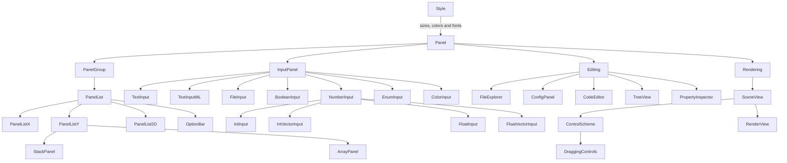

# UI system in Rem's Engine

The UI system is inspired by the standard Android UI:
There are Panels, and they are aligned by weights, minimum size, aspect ratio, grids, lists and such.

```mermaid
graph TB
    Style -- sizes, colors and fonts --> Panel
    Panel --> PanelGroup
    PanelGroup --> PanelList
    PanelList --> PanelListX
    PanelList --> PanelListY
    PanelList --> PanelList2D
    PanelListY --> StackPanel
    PanelListY --> ArrayPanel
    PanelList --> OptionBar
    Panel --> InputPanel
    InputPanel --> TextInput
    InputPanel --> TextInputML
    InputPanel --> FileInput
    InputPanel --> BooleanInput
    InputPanel --> NumberInput
    InputPanel --> EnumInput
    InputPanel --> ColorInput
    NumberInput --> IntInput
    NumberInput --> IntVectorInput
    NumberInput --> FloatInput
    NumberInput --> FloatVectorInput
    Panel --> Editing
    Editing --> FileExplorer
    Editing --> ConfigPanel
    Editing --> CodeEditor
    Editing --> TreeView
    Editing --> PropertyInspector
    Panel --> Rendering
    Rendering --> SceneView
    SceneView --> ControlScheme
    ControlScheme --> DraggingControls
    SceneView --> RenderView
```